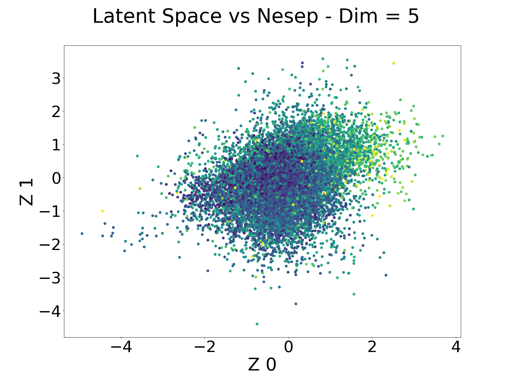
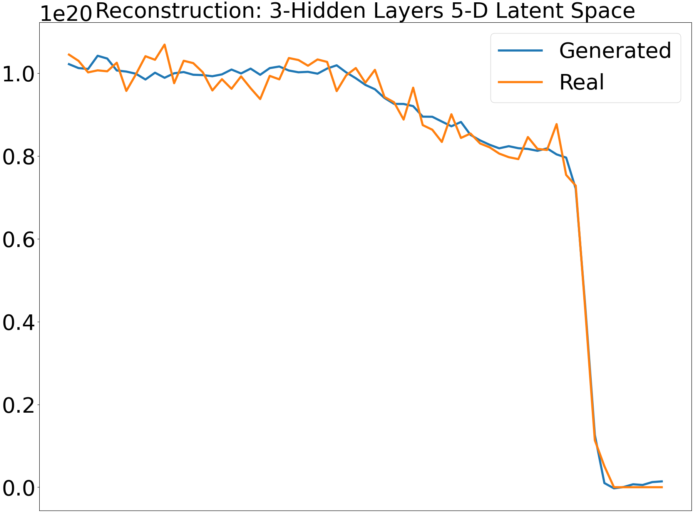

Generating Time-Independent Profile(s) [PSI 2022]
=================================================

We want to use Variational Autoencoders to generate density and temperature profiles in the edge/scrape-of-layer.

This is a semi-unsupervised learning approach, where we use the profiles to then predict profiles, and in doing so we encode the information in a latent space, that can be used to generate new samples.

Goals
~~~~~

0. Machine parameters per profile slice

  * The machine parameters per time slice should not vary that much (currently flat top H-modes),
  * But, it is still best practice to grab specific machine parameters per time slice

1. Normalize machine parameters

  * Standardization
  * Normalizing flows

    * **if** standardization does not constrain machine parameters to normal distribution

2. Generate density (and tempearture) profiles using VAEs and encode machine control parameters into latent spaces

  * VAE has dual latent spaces, `z_stochastic, z_machine` (graph below)
  * Loss function to match: :math:`L = \alpha MSE(y, \hat{y}) + \beta_{stoch} KL((mu_{stoch}, var_{stoch}), \mathcal{N}(0, 1)) + \beta_{mach} KL((mu_{machine}, var_{machine}), \mathcal{N}(0, 1)) + \gamma MSE(mu_{machine}, machine_{real, norm})`
  * Find :math:`\alpha, \beta, \gamma` that evenly regularizes the two latent spaces
  * Should be able to hold `z_machine` constant and sample from `z_stochastic` without too much change in the profiles.

.. image:: ./images/dual_vae.svg
  :width: 200

Accomplished
"""""""""""""

* A simple 1D Convolutional VAE that can represent profiles given the previous profiles.
* Initial Latent space discovery shows that even 4 dim can recreate the profile
* Beta + Gamma VAEs coded, but not optimized

Initial Results
""""""""""""""""

Ongoing's
~~~~~~~~~~

1. Model development

  * Allow input of Te and Ne profiles into model
  * Layers and how to stack them

2. Experiments

  * Rework Experiment class to be able to plot Te from given Ne for test set
  * Achieve a successful Beta run

4. Data

  * Psep
  * Diagnostics?

Models
-------

All models are found in the :file:`src/models/` and are written with pytorch, see the models page for more info.

Experiments
--------------

We use pytorch lightning, but this is subject to change.
See :file:`src/experiment.py` and :file:`src/run.py`
